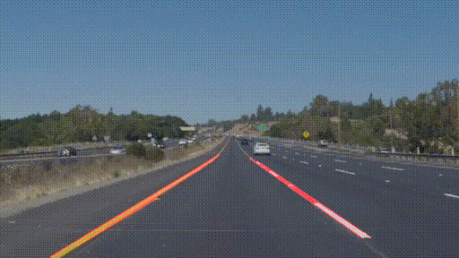

# **Project: Finding Lane Lines on the Road** 

Overview
---

The goal of this project is to find road lanes from a camera video/images. The steps of this project are the following:
* Make a video processing pipeline that finds lane lines on the road 
* Reflect on the work in a written report

The following Jupyter notebook contains the solution [code](https://github.com/dringakn/CarND-LaneLines-P1/blob/master/P1.ipynb).

### Reflection
---
### Image Processing Pipeline

The road lines detection function takes as input an image. The image is pre-processed as follows
* Convert the color image to a grayscale image.
* Remove the noise within the image using a Gaussian blur filter.
* Apply Canny edge detection on the filtered image.
* Masked out the unwanted edges in a specified ROI.
* Apply Hough transformation to detect lines.
* Annotate the color image with detected lines.
* Repeat the steps 1-6 for every frame of the video.

### Potential shortcomings with the current pipeline

This solution might fail under challenging enviormental conditions such as snow, less ambient light etc.
This algorithm assumes straight lines, therefore, it may fail if this assuption doesn't satisfies.

### Possible improvements to the pipeline

The canny edge filter and Hough transformation algorithms may be tweaked for further improvements.
The code can be implemented using C++ to improve execution performance in real time.

